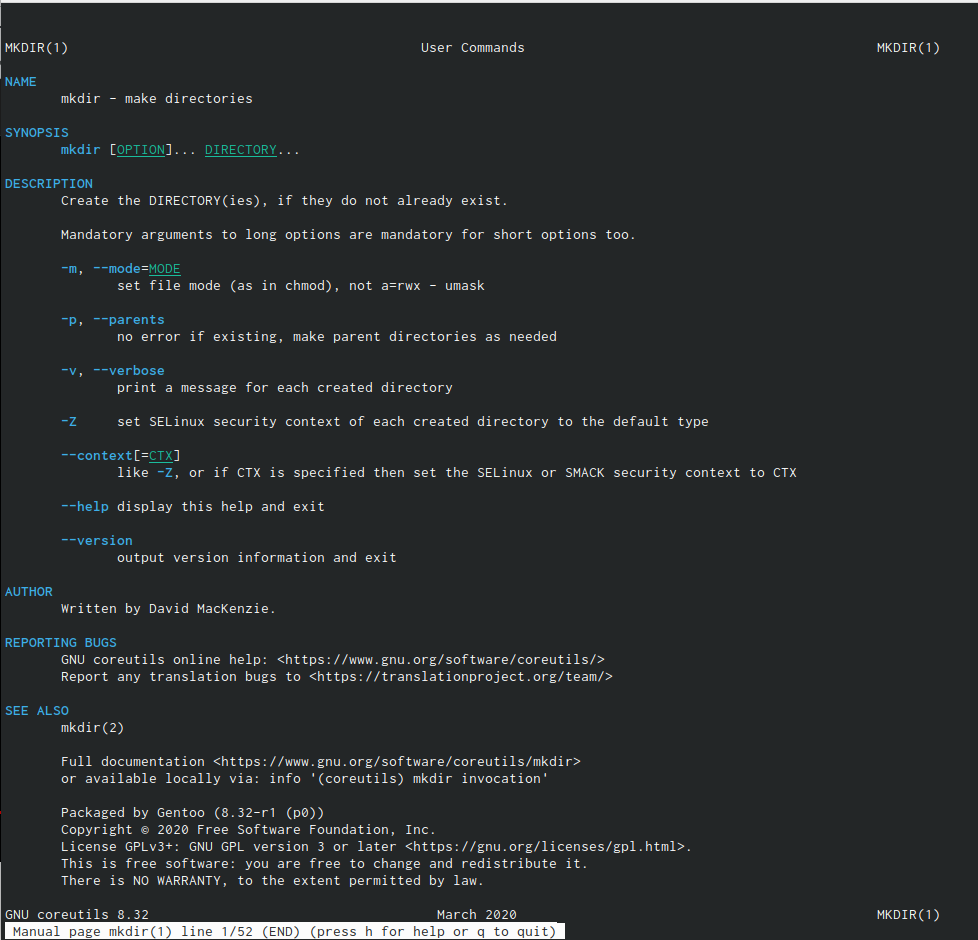
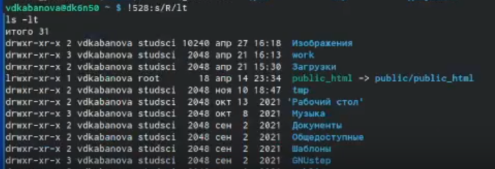

---
## Front matter
title: "Отчет по лабораторной работе №3"
subtitle: "*Дисциплина: Операционные системы*"
author: "Кабанова Варвара Дмитриевна"

## Generic otions
lang: ru-RU
toc-title: "Содержание"

## Bibliography
bibliography: bib/cite.bib
csl: pandoc/csl/gost-r-7-0-5-2008-numeric.csl

## Pdf output format
toc: true # Table of contents
toc-depth: 2
lof: true # List of figures
lot: true # List of tables
fontsize: 12pt
linestretch: 1.5
papersize: a4
documentclass: scrreprt
## I18n polyglossia
polyglossia-lang:
  name: russian
  options:
	- spelling=modern
	- babelshorthands=true
polyglossia-otherlangs:
  name: english
## I18n babel
babel-lang: russian
babel-otherlangs: english
## Fonts
mainfont: PT Serif
romanfont: PT Serif
sansfont: PT Sans
monofont: PT Mono
mainfontoptions: Ligatures=TeX
romanfontoptions: Ligatures=TeX
sansfontoptions: Ligatures=TeX,Scale=MatchLowercase
monofontoptions: Scale=MatchLowercase,Scale=0.9
## Biblatex
biblatex: true
biblio-style: "gost-numeric"
biblatexoptions:
  - parentracker=true
  - backend=biber
  - hyperref=auto
  - language=auto
  - autolang=other*
  - citestyle=gost-numeric
## Pandoc-crossref LaTeX customization
figureTitle: "Рис."
tableTitle: "Таблица"
listingTitle: "Листинг"
lofTitle: "Список иллюстраций"
lotTitle: "Список таблиц"
lolTitle: "Листинги"
## Misc options
indent: true
header-includes:
  - \usepackage{indentfirst}
  - \usepackage{float} # keep figures where there are in the text
  - \floatplacement{figure}{H} # keep figures where there are in the text
---

# Цель работы

Приобретение практических навыков взаимодействия пользователя с системой посредством командной строки

# Выполнение лабораторной работы

Определяю полное имя своего домашнего каталога(рис.1). 

{ #fig:001 width=70% }

Перехожу в каталог/tmp.Вывожу на экран содержимое каталога /tmp (рис.2). 

{ #fig:002 width=70% }

Для того,чтобы отобразить имена скрытых файлов,использую команду ls с опцией a (рис.3).

{ #fig:003 width=70% }

Использование опции F добавит символ «/» в конце каждого каталога(рис.4)

{ #fig:004 width=70% }

Чтобы вывести на экран подробную информацию о файлах и каталогах,использую опцию l.При этом о каждом файле и каталоге будет выведена следующая информация:тип файла,право доступа,число ссылок,владелец,размер,дата последней ревизии,имя файла или каталога (рис.4).

{ #fig:005 width=70% }

Чтобы вывести скрытые файлы, полную информацию о файлах и тип файлов, использую опцию alF (рис.6)

{ #fig:006 width=70% }

Определяю,есть ли в каталоге/var/spool подкаталог с именем cron (рис.7).

{ #fig:007 width=70% }

Перехожу в домашний каталог и вывожу на экран его содержимое (рис.8)

{ #fig:008 width=70% }

С помощью опции -l определяю,кто является владельцем файлов и подкаталогов (рис.9)

{ #fig:009 width=70% }

В домашнем каталоге создаю новый каталог с именем newdir. В каталоге ~/newdir создаю новый каталог с именем morefun (рис.10).

{ #fig:010 width=70% }

В домашнем каталоге создаю одной командой три новых каталога с именами letters,memos,misk.Затем удаляю эти каталоги одной командой (рис.11)

{ #fig:011 width=70% }

Пробую удалить ранее созданный каталог ~/newdir командой rm.Вижу, что удаление каталога невозможно, тк в нем имеется другой каталог (рис.12).

{ #fig:012 width=70% }

Удаляю каталог с помощью команды rm-r. Использую команду ls, чтобы вывести содержимое каталога, убеждаюсь, что каталог был удален (рис. 13). 

{ #fig:013 width=70% }

С помощью команды man (рис. 14-16) определяю, какую опцию команды ls нужно использовать для просмотра содержимого не только указанного каталога,но и подкаталогов,входящих в него. 

{ #fig:014 width=70% }

{ #fig:015 width=70% }

{ #fig:016 width=70% }

Понимаю, что это можно сделать с помощью опции R (рис. 17-18).

{ #fig:017 width=70% }

{ #fig:018 width=70% }

С помощью команды man определяю набор опций команды ls,позволяющий отсортировать по времени последнего изменения выводимый список содержимого каталогас развёрнутым описанием файлов. Понимаю, что это можно сделать с помощью опции lt (рис. 19) 

{ #fig:019 width=70% }

Использую команду man для просмотра описания следующих команд:

- cd (рис.20-22)

{ #fig:020 width=70% }

{ #fig:021 width=70% }

{ #fig:022 width=70% }

- pwd (рис.23-24)

{ #fig:023 width=70% }

{ #fig:024 width=70% }

- mkdir (рис.25-26)

{ #fig:025 width=70% }

{ #fig:026 width=70% }

- rmdir (рис.27-28)

{ #fig:027 width=70% }

{ #fig:028 width=70% }

- rm (рис.29-30)

{ #fig:029 width=70% }

{ #fig:030 width=70% }

Используя информацию,полученную при помощи команды history (рис. 31-32),выполняю модификацию и исполнение нескольких команд из буфера команд (рис.33-34).

{ #fig:033 width=70% }

{ #fig:034 width=70% }

# Выводы

В ходе выполнения данной лабораторной работы я приобрела практические навыки взаимодействия пользователя с системой посредством командной строки

# Контрольные вопросы

1. Что такое командная строка?
2. При помощи какой команды можно определить абсолютный путь текущего каталога? Приведите пример.
3. При помощи какой команды и каких опций можно определить только тип файлови их имена втекущем каталоге? Приведите примеры.
4. Каким образом отобразить информацию о скрытых файлах? Приведите примеры.
5. При помощи каких команд можно удалить файл и каталог? Можно ли это сделатьодной и той же командой? Приведите примеры.
6. Каким образом можно вывести информацию о последних выполненных пользовате-лем командах? работы?
7. Как воспользоваться историей команд для их модифицированного выполнения? Приведите примеры.
8. Приведите примеры запуска нескольких команд в одной строке.
9. Дайте определение и приведите примера символов экранирования.
10. Охарактеризуйте вывод информации на экран после выполнения команды ls с опцией l.
11. Что такое относительный путь к файлу? Приведите примеры использования относительного и абсолютного пути при выполнении какой-либо команды.
12. Как получить информацию об интересующей вас команде?
13. Какая клавиша или комбинация клавиш служит для автоматического дополнения вводимых команд?

1. Взаимодействие пользователя с системой Linux (работа с данными и управление работающими в системе процессами) происходит в интерактивном режиме посредством командного языка. Оболочка операционной системы (или командная оболочка, интерпретатор команд) — интерпретирует (т.е. переводит на машинный язык) вводимые пользователем команды, запускает соответствующие программы (процессы), формирует и выводит ответные сообщения. Кроме того, на языке командной оболочки можно писать небольшие программы для выполнения ряда последовательных операций с файлами и содержащимися в них данными — сценарии (скрипты). 
2. Абсолютный путь к текущему каталогу можно определить с помощью команды pwd.   
3. С помощью команд ls, ls -a можно определить только название и формат файлов и каталогов. Отличаются они лишь тем, что вторая команда выводит также скрытые файлы и каталоги.
4. Скрытые файлы можно отобразить, введя в командную строку команду ls -a.
5. Команда rm удаляет файлы, а с опцией -r также удаляет в том числе непустые каталоги. Пустые каталоги можно удалить, используя команду rmdir.
6. Команда history позволяет вывести на экран информацию о последних выполненных пользователем команд.   
7. Команда history позволяет нам узнать номер выполненных команд, который нужен чтобы модифицировать их. Например, !:s//.
8. Чтобы запустить несколько команд в одной строке, достаточно написать их через точку с запятой. Например, cd; ls.
9. Если в заданном контексте (при модификации команд) встречаются специальные символы (типа «.», «/», «*» и т.д.), надо перед ними поставить символ экранирования  (обратный слэш). 
10. Команда ls -l позволяет увидеть права доступа и владельцев каталогов и файлов.
11. В случае абсолютной адресации путь к каталогу указывается, начиная с корневого каталога, и далее вниз по дереву папок до требуемого. При относительной адресации путь к каталогу указывается, начиная с текущего каталога (другими словами, относительно текущего каталога). Когда используется относительная адресация, слэш никогда не бывает первым знаком.
Относительный и абсолютный путь используются в команде cd. Например,
cd ~/work/study
cd work/study
Используя и первую, и вторую команду, мы сможем попасть в папку study. Их отличе в том, что в первом случае мы указывали абсолютный путь, тогда как во втором - только относительный.
12. Чтобы полчуить информацию о какой-либо команде, нужно ввести man .
13. Клавиша Tab служит для автоматического дополнения вводимыз команд.

# Список литературы{.unnumbered}

::: {#refs}
:::
