---
# Front matter
lang: ru-RU
title: "Лабораторная работа №9"
subtitle: "Дисциплина: Операционные системы"
author: "Кабанова Варвара"

# Formatting
toc-title: "Содержание"
toc: true # Table of contents
toc_depth: 2
lof: true # List of figures
lot: true # List of tables
fontsize: 12pt
linestretch: 1.5
papersize: a4paper
documentclass: scrreprt
polyglossia-lang: russian
polyglossia-otherlangs: english
mainfont: PT Serif
romanfont: PT Serif
sansfont: PT Sans
monofont: PT Mono
mainfontoptions: Ligatures=TeX
romanfontoptions: Ligatures=TeX
sansfontoptions: Ligatures=TeX,Scale=MatchLowercase
monofontoptions: Scale=MatchLowercase
indent: true
pdf-engine: lualatex
header-includes:
  - \linepenalty=10 # the penalty added to the badness of each line within a paragraph (no associated penalty node) Increasing the value makes tex try to have fewer lines in the paragraph.
  - \interlinepenalty=0 # value of the penalty (node) added after each line of a paragraph.
  - \hyphenpenalty=50 # the penalty for line breaking at an automatically inserted hyphen
  - \exhyphenpenalty=50 # the penalty for line breaking at an explicit hyphen
  - \binoppenalty=700 # the penalty for breaking a line at a binary operator
  - \relpenalty=500 # the penalty for breaking a line at a relation
  - \clubpenalty=150 # extra penalty for breaking after first line of a paragraph
  - \widowpenalty=150 # extra penalty for breaking before last line of a paragraph
  - \displaywidowpenalty=50 # extra penalty for breaking before last line before a display math
  - \brokenpenalty=100 # extra penalty for page breaking after a hyphenated line
  - \predisplaypenalty=10000 # penalty for breaking before a display
  - \postdisplaypenalty=0 # penalty for breaking after a display
  - \floatingpenalty = 20000 # penalty for splitting an insertion (can only be split footnote in standard LaTeX)
  - \raggedbottom # or \flushbottom
  - \usepackage{float} # keep figures where there are in the text
  - \floatplacement{figure}{H} # keep figures where there are in the text
---

# Цель работы

Цель данной лабораторной работы --- Познакомиться с операционной системой Linux. Получить практические навыки работы с редактором Emacs.

# Выполнение лабораторной работы

Открыла редактор Emacs с помощью команды «emacs &» (рис.1).

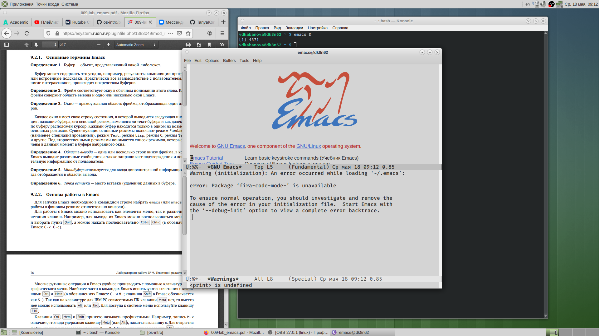{ #fig:001 width=70% }

Создала файл lab07.sh с помощью комбинации «Ctrl-x» «Ctrl-f».

{ #fig:002 width=70% }

В открывшемся буфере набрала необходимый текст (алгоритм действий представлен на рис. -@fig:003 ).

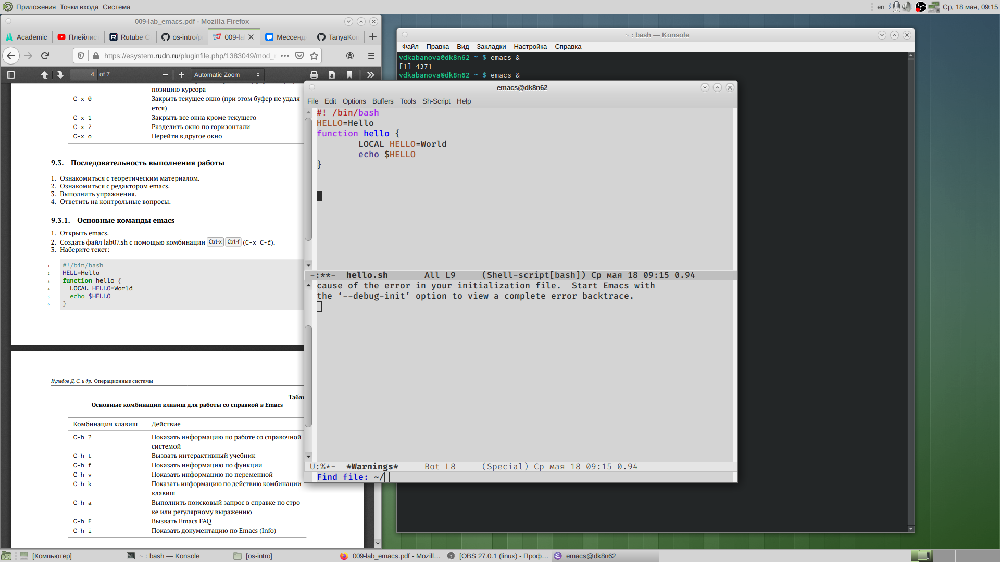{ #fig:003 width=70% }

Сохранила файл с помощью комбинации «Ctrl-x»«Ctrl-s».

Выполнила следующие действия:

- Вырезала одной командой целую строку («Сtrl-k») (рис.4).

{ #fig:004 width=70% }

- Вставила эту строку в конец файла («Ctrl-y») (рис.5).

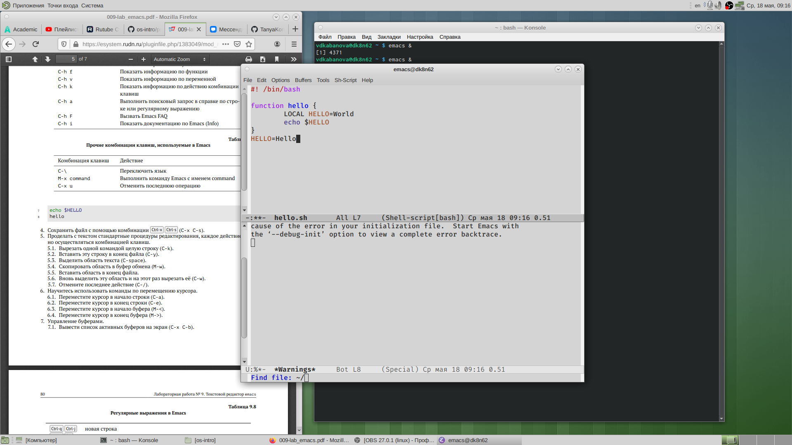{ #fig:005 width=70% }

- Выделила область текста («Ctrl-space») (рис.6).

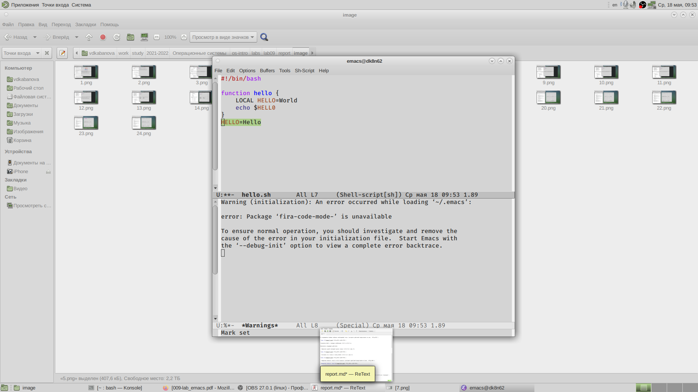{ #fig:006 width=70% }

- Скопировала область в буфер обмена («Alt-w»). Вставила область в конец файла («Ctrl-y») (рис.7).

{ #fig:007 width=70% }

- Вновь выделила эту область («Ctrl-space») и на этот раз вырезала её («Ctrl-w») (рис.8).

{ #fig:008 width=70% }

- Отменила последнее действие («Ctrl-/») (рис.9).

{ #fig:009 width=70% }

Выполнила следующие действия:

- Переместила курсор в начало строки («Ctrl-a») (рис.10).

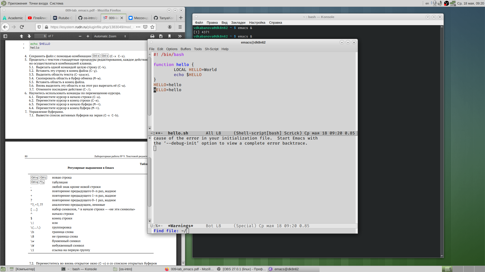{ #fig:010 width=70% }

- Переместила курсор в конец строки («Ctrl-e») (рис.11).

{ #fig:011 width=70% }

- Вывела список активных буферов на экран («Ctrl-x»«Ctrl-b») (рис.12).

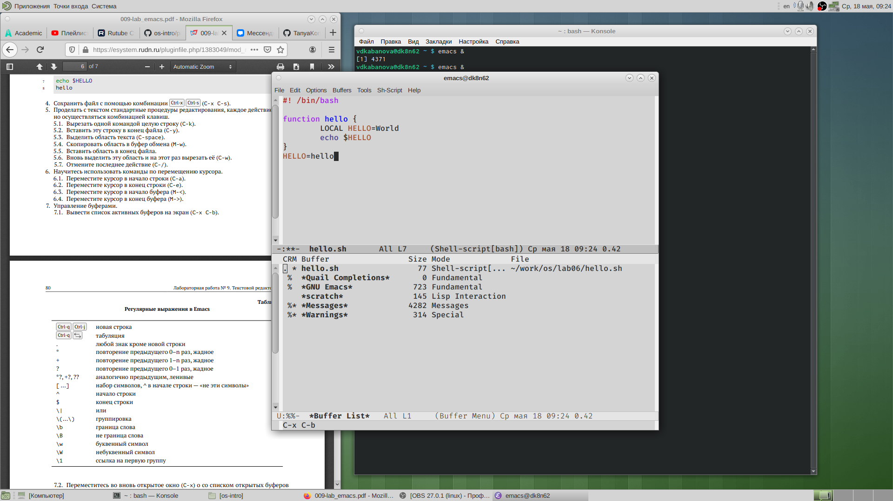{ #fig:012 width=70% }

- Переместилась во вновь открытое окно («Ctrl-xo») со  списком открытых буферов и переключилась на другой буфер (для этого нажала на «enter» после выбора необходимого буфера) (рис.13).

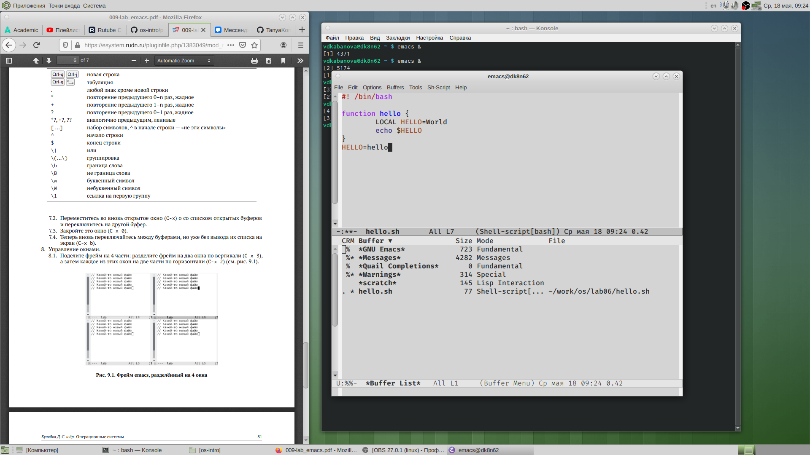{ #fig:013 width=70% }

Выполнила следующие действия:

- Поделила фрейм  на  4  части:  разделила  фрейм  на  два  окна  по вертикали («Ctrl-x 3»), а затем каждое из этих окон на две части по горизонтали («Ctrl-x 2») (рис.14).

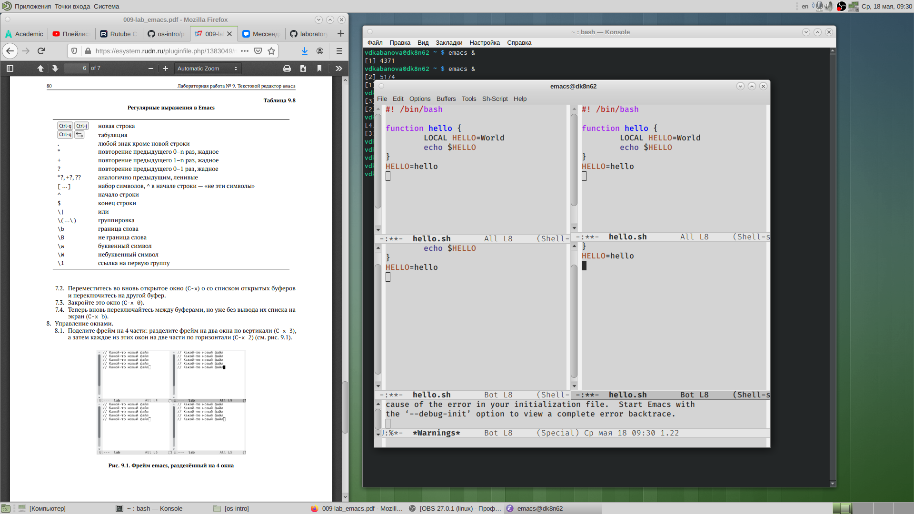{ #fig:014 width=70% }

8.2. В каждом из четырёх созданных окон открыла новый буфер (файл) и ввела несколько строк текста. Для этого предварительно создала эти файлы с помощью команд «touch example1.txt», «touch example2.txt», «touch example3.txt», «touch example4.txt» (рис.15-18).

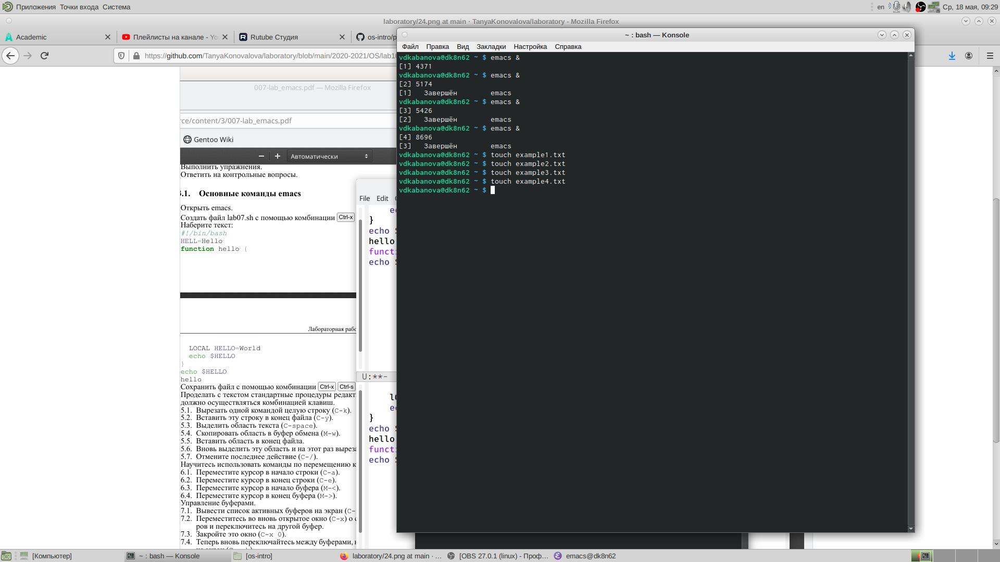{ #fig:015 width=70% }

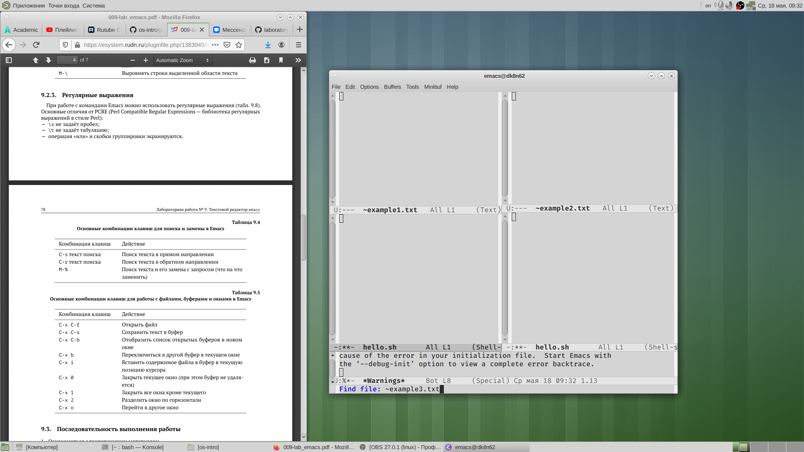{ #fig:016 width=70% }

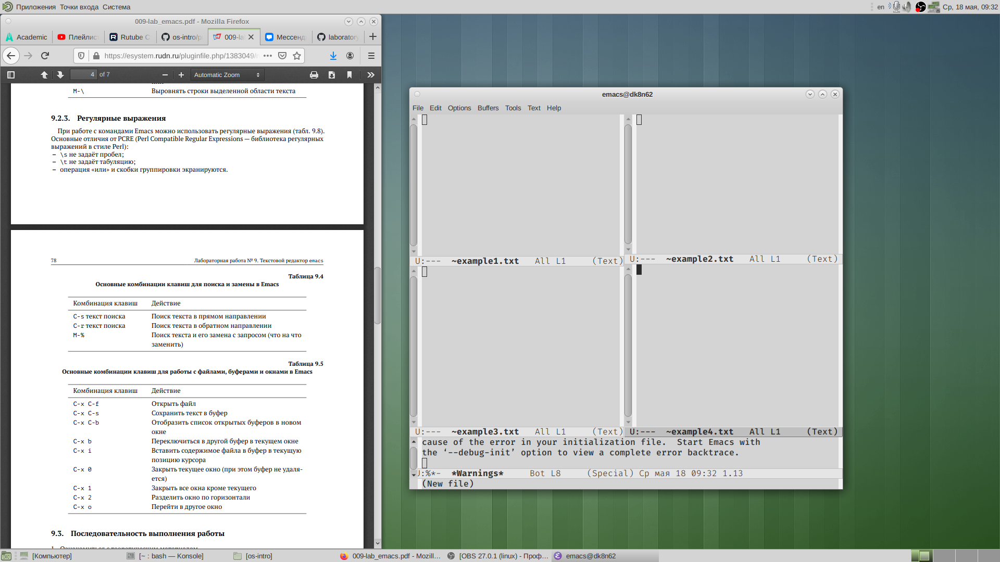{ #fig:017 width=70% }

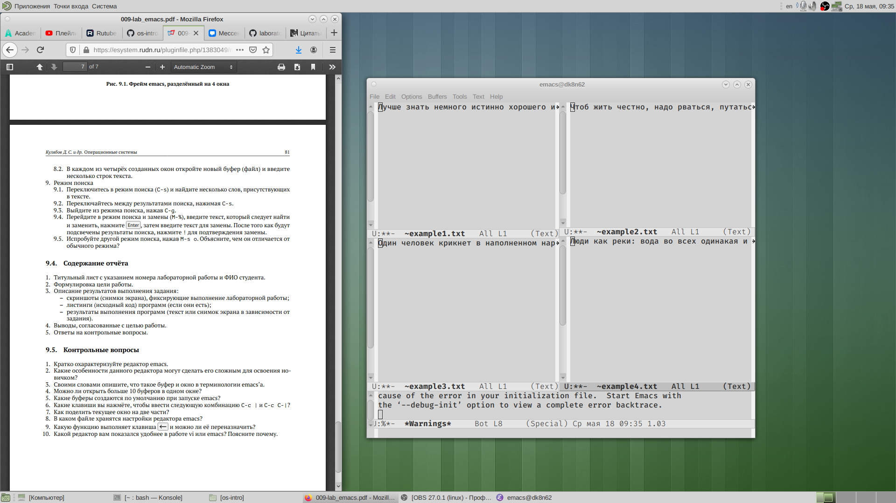{ #fig:018 width=70% }

Выполнила слеюущиеся действия:

- Переключила в режим поиска («Ctrl-s») и нашла несколько слов, присутствующих в тексте (рис. 19-21).

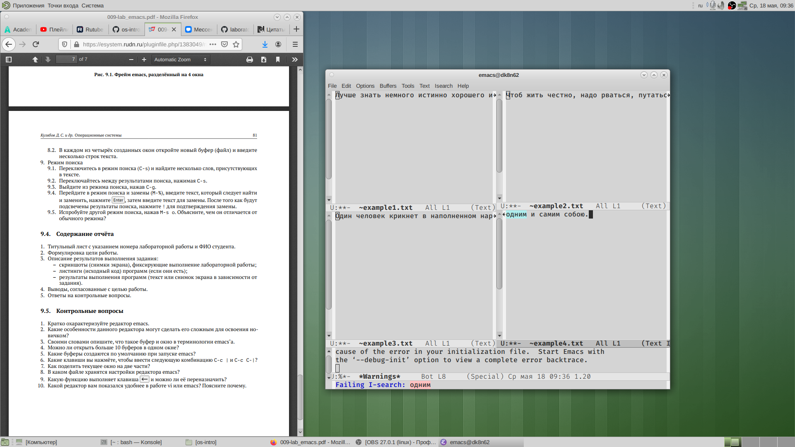{ #fig:019 width=70% }

{ #fig:020 width=70% }

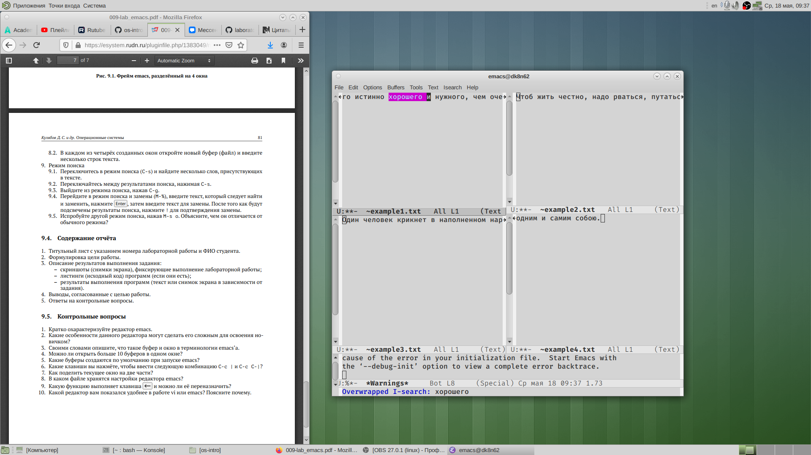{ #fig:021 width=70% }

- Переключилась между результатами поиска, нажимая «Ctrl-s» 

- Вышла из режима поиска, нажав «Ctrl-g» (рис.22)

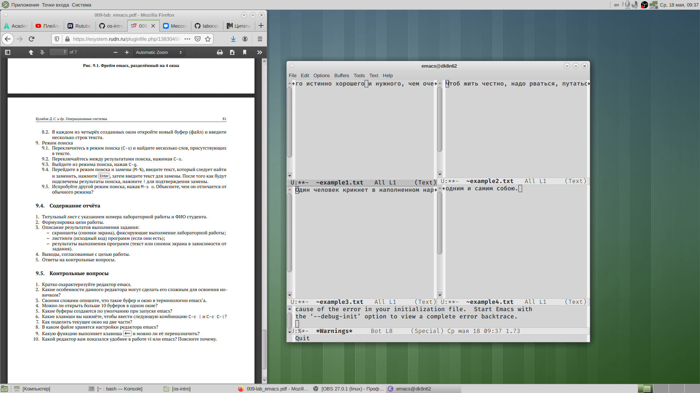{ #fig:022 width=70% }

# Ответы на контрольные вопросы

1) Emacs − один из наиболее мощных и широко распространённых редакторов, используемых в мире Unix. По популярности он соперничает с редактором vi и его клонами. В зависимости от ситуации, Emacs может быть текстовым редактором;
программой для чтения почты и новостей Usenet;
интегрированной средой разработки (IDE);
операционной системой и т.д.Всё это разнообразие достигается благодаря архитектуре Emacs, которая позволяет расширять возможности редактора при помощи языка Emacs Lisp. На языке C написаны лишь самые базовые и низкоуровневые части Emacs, включая полнофункциональный.
интерпретатор языка Lisp. Таким образом, Emacs имеет встроенный язык программирования, который может использоваться для настройки, расширения и изменения поведения редактора. В действительности, большая часть того редактора, с которым пользователи Emacs работают в наши дни,написана на языке Lisp.

2) Основную трудность для новичков при освоенииданного редактора могутсоставлять большое количество команд, комбинаций клавиш, которые не получится все запомнить с первого раза и поэтоупридется часто обращаться к справочным материалам.

3) Буфер –это объект, представляющий собой текст. Если имеется несколько буферов, то редактировать можно только один. Обычно буфер считывает данные из файла или записывает в файл данные из буфера.Окно –это область экрана, отображающая буфер. При запуске редактора отображается одно окно, но при обращении к некоторым функциям могут открыться дополнительные окна. Окна Emacsи окна графической среды XWindow–разные вещи. Одно окно XWindowможет быть разбито на несколько окон в смысле Emacs, в каждом из которых отображается отдельный буфер.

4) Да, можно.

5) При запуске Emacsпо умолчанию создаются следующие буферы:
«scratch»(буфер для несохраненного текста) «Messages»(журнал ошибок, включающий такжеинформацию, которая появляется в области EchoArea) «GNUEmacs»(справочный буфер о редакторе).

6) C-c |сначала, удерживая «ctrl»,нажимаю «c»,после –отпускаюобе клавишии нажимаю «|» C-cC-|сначала, удерживая «ctrl»,нажимаю «с», после –отпускаю обе клавиши и, удерживая «ctrl», нажимаю «|».

7) Чтобы поделить окно на две части необходимо воспользоваться комбинацией «Ctrl-x 3»(по вертикали) или «Ctrl-x 2» (по горизонтали).

8) Настройки Emacsхранятся в файле .emacs.

9) По умолчанию клавиша «←» удаляет символперед курсором, нов редакторе её можно переназначить. Для этого необхдимоизменить конфигурацию файла .emacs.

10) Более удобным я считаю редактор emacs, потому чтов нем проще открывать другие файлы, можно использовать сразу несколько окон, нет «Командногорежима», «Режима ввода», «Режима командной строки», которые являются немного непривычными и в какой-то степени неудобным.

# Выводы

В ходе выполнения данной лабораторной работы я познакомилась с операционной системой Linux и получила практические навыки работы с редактором Emacs.
