---
# Front matter
lang: ru-RU
title: "Лабораторная работа №13"
subtitle: "Дисциплина: Операционные системы"
author: "Кабанова Варвара Дмитриевна"

# Formatting
toc-title: "Содержание"
toc: true # Table of contents
toc_depth: 2
lof: true # List of figures
lot: true # List of tables
fontsize: 12pt
linestretch: 1.5
papersize: a4paper
documentclass: scrreprt
polyglossia-lang: russian
polyglossia-otherlangs: english
mainfont: PT Serif
romanfont: PT Serif
sansfont: PT Sans
monofont: PT Mono
mainfontoptions: Ligatures=TeX
romanfontoptions: Ligatures=TeX
sansfontoptions: Ligatures=TeX,Scale=MatchLowercase
monofontoptions: Scale=MatchLowercase
indent: true
pdf-engine: lualatex
header-includes:
  - \linepenalty=10 # the penalty added to the badness of each line within a paragraph (no associated penalty node) Increasing the value makes tex try to have fewer lines in the paragraph.
  - \interlinepenalty=0 # value of the penalty (node) added after each line of a paragraph.
  - \hyphenpenalty=50 # the penalty for line breaking at an automatically inserted hyphen
  - \exhyphenpenalty=50 # the penalty for line breaking at an explicit hyphen
  - \binoppenalty=700 # the penalty for breaking a line at a binary operator
  - \relpenalty=500 # the penalty for breaking a line at a relation
  - \clubpenalty=150 # extra penalty for breaking after first line of a paragraph
  - \widowpenalty=150 # extra penalty for breaking before last line of a paragraph
  - \displaywidowpenalty=50 # extra penalty for breaking before last line before a display math
  - \brokenpenalty=100 # extra penalty for page breaking after a hyphenated line
  - \predisplaypenalty=10000 # penalty for breaking before a display
  - \postdisplaypenalty=0 # penalty for breaking after a display
  - \floatingpenalty = 20000 # penalty for splitting an insertion (can only be split footnote in standard LaTeX)
  - \raggedbottom # or \flushbottom
  - \usepackage{float} # keep figures where there are in the text
  - \floatplacement{figure}{H} # keep figures where there are in the text
---

# Цель работы

Приобретение простейших навыков разработки, анализа, тестирования и отладки приложений в ОС типа UNIX/Linux на примере создания на языке программирования С калькулятора с простейшими функциями.

# Выполнение лабораторной работы

В  домашнем  каталоге  создаю  подкаталог ~/work/os/lab_prog с помощью команды «mkdir-p~/work/os/lab_prog» (рис.1). Вся необходимая информация про создания каталогов указана в следующем источнике: Программное обеспечение GNU/Linux. Лекция 9. Хранилище и дистрибутив (Г. Курячий, МГУ).

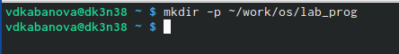{ #fig:001 width=70% }

Создала в каталоге файлы: calculate.h, calculate.c, main.c, используя команды «cd ~/work/os/lab_prog» и «touch calculate.h calculate.c main.c» (рис.2).

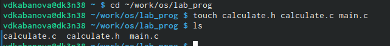{ #fig:002 width=70% }

Это  будет  примитивнейший  калькулятор,  способный  складывать, вычитать,  умножать  и  делить,  возводить  число  в  степень,  брать квадратный корень, вычислять sin, cos, tan. При запуске он будет запрашивать  первое  число,  операцию,  второе  число.  После  этого программа выведет результат и остановится. Открыв редактор Emacs, приступила к редактированию созданных файлов. Реализация функций калькулятора в файле calculate.с (рис.3-4). Вся необходимая информация про написания программ указана в следующем источнике: Программное обеспечение GNU/Linux. Лекция 10. Минимальный набор знаний (Г. Курячий, МГУ).

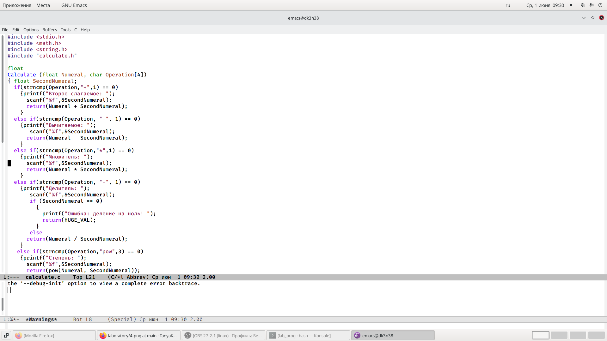{ #fig:003 width=70% }

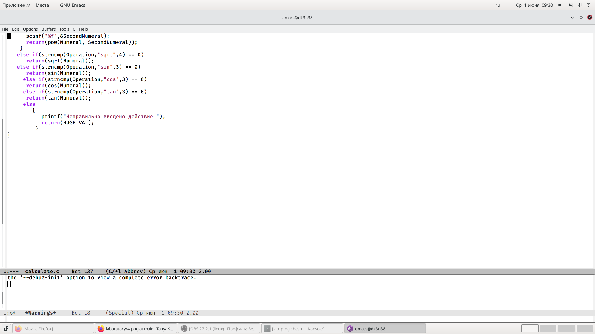{ #fig:004 width=70% }

Интерфейсный файл calculate.h, описывающий формат вызова функции калькулятора (рис.5). Подробная информация о написании программ в Linux указана в следующем источнике: Электронный ресурс: Электронный ресурс: https://it.wikireading.ru/34160 

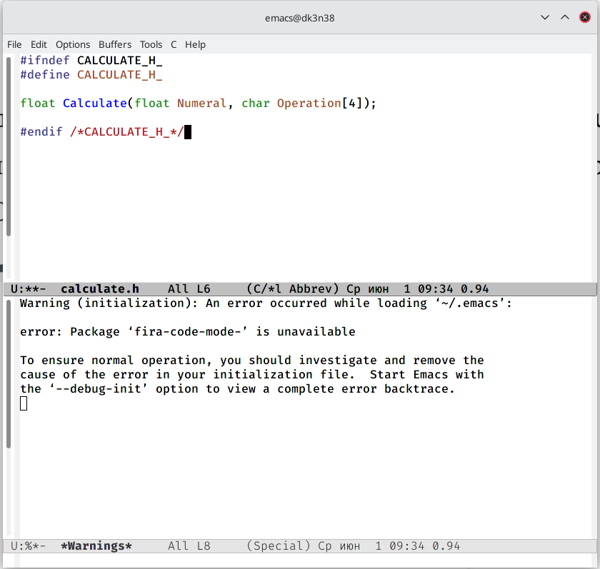{ #fig:005 width=70% }

Основной файл main.c, реализующий интерфейс пользователя к калькулятору (рис.6).

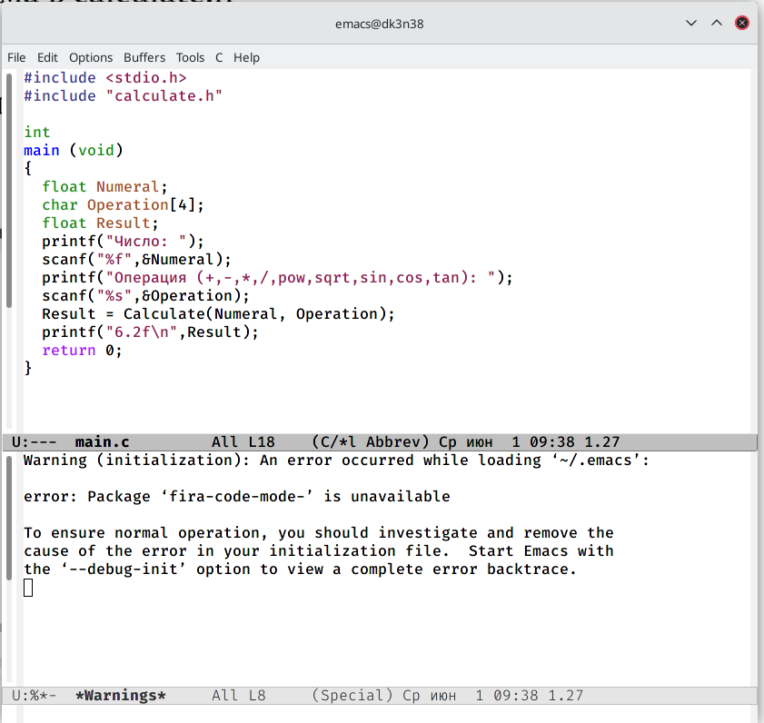{ #fig:006 width=70% }

Выполнила компиляцию программы посредством gcc (версия компилятора :8.3.0-19), используя команды «gcc -c calculate.c», «gcc -c main.c» и «gcc calculate.o main.o -o calcul -lm» (рис.7).

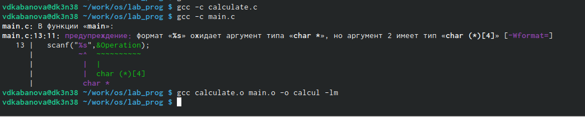{ #fig:007 width=70% }

В ходе компиляции программы никаких ошибок выявлено не было.

Создала Makefile с необходимым содержанием (рис.8).

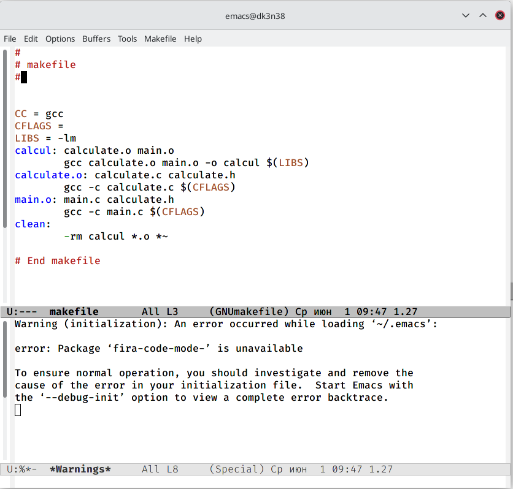{ #fig:008 width=70% }

Данный файл необходим для автоматической компиляции файлов calculate.c (цель calculate.o), main.c (цельmain.o), а также их объединения в один исполняемый файл calcul (цель calcul). Цель clean нужна для автоматического удаления файлов. Переменная CC отвечает за утилиту для компиляции. Переменная CFLAGS отвечает за опции в данной утилите. Переменная LIBS отвечает за опции для объединения объектных файлов в один исполняемый файл.

Далее исправила Makefile (рис.9). Подробная информация о написании программ в Linux указана в следующем источнике: Электронный ресурс: https://vunivere.ru/work23597

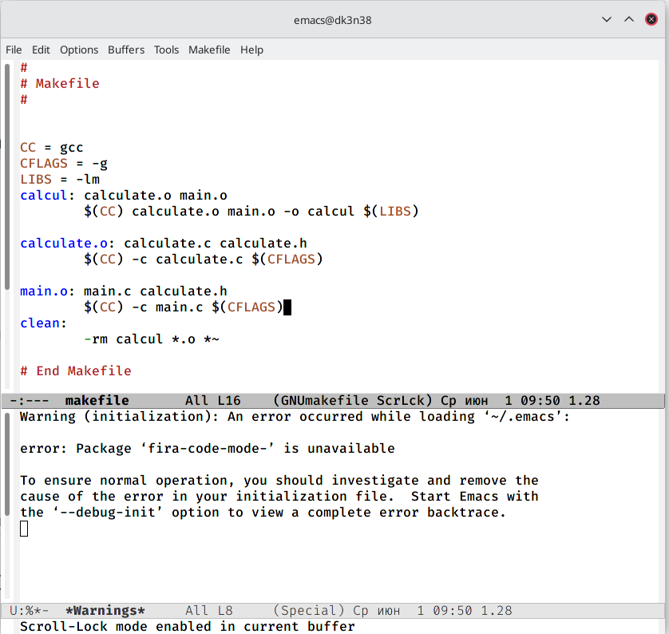{ #fig:009 width=70% }

В переменную CFLAGS добавила опцию -g, необходимую для компиляции объектных файлов и их использования в программе отладчика GDB. Сделала так, что утилита компиляции выбирается с помощью переменной CC. После этого я удалила исполняемые и объектные файлы из каталога с помощью команды «make clear» (рис.10). Выполнила компиляцию файлов, используя команды «make calculate.o», «make main.o», «make calcul» (рис.11).

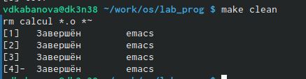{ #fig:010 width=70% }

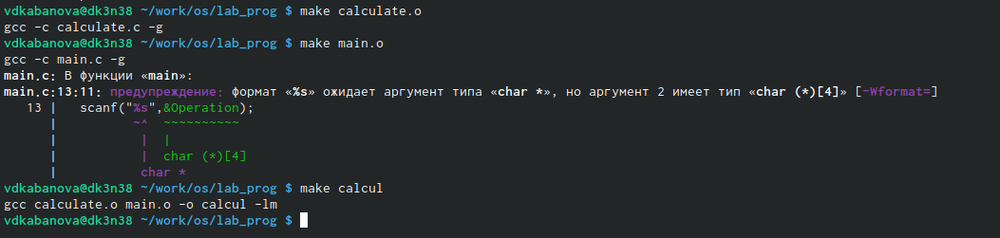{ #fig:011 width=70% }

Далее с помощью gdb выполнила отладку программы calcul. Запустила отладчик GDB, загрузив в него программу для отладки, используя команду: «gdb./calcul» (рис.12).

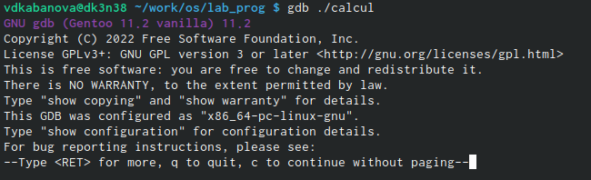{ #fig:012 width=70% }

Для запуска программы внутри отладчика ввела команду «run» (рис.13).

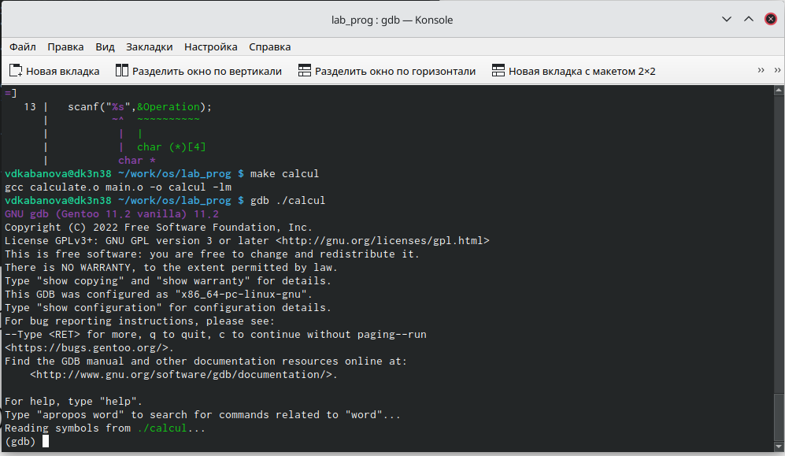{ #fig:013 width=70% }

Для постраничного (по 10 строк) просмотра исходного кода использовала команду «list» (рис.14).

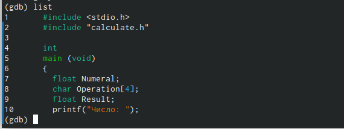{ #fig:014 width=70% }

Для просмотра строк с 12 по 15 основного файла использовала команду «list 12,15» (рис.15).

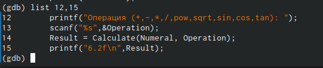{ #fig:015 width=70% }

Для просмотра определённых строк не основного файла использовала команду «list calculate.c:20,29» (рис.16).

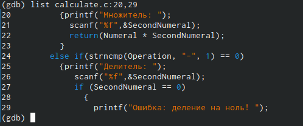{ #fig:016 width=70% }

Установила точку останова в файле calculate.c на строке номер 21, используя команды «list calculate.c:20,27» и «break 21» (рис.17).

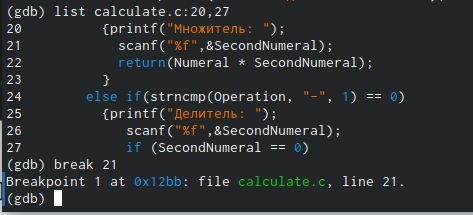{ #fig:017 width=70% }

Вывела информацию об имеющихся в проекте точках останова с помощью команды «info breakpoints» (рис.18).

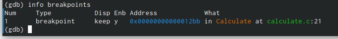{ #fig:018 width=70% }

Запустила программу внутри отладчика и убедилась, что программа остановилась в момент прохождения точки останова. Использовала команды «run», «5», «*» и «backtrace» (рис.19).

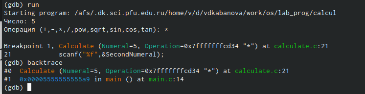{ #fig:019 width=70% }

Посмотрела, чему равно на этом этапе значение переменной Numeral, введя команду «print Numeral» (рис.20).

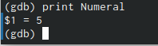{ #fig:020 width=70% }

Сравнила с результатом вывода на экран после использования команды «display Numeral». Значения совпадают (рис.21).

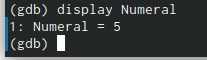{ #fig:021 width=70% }

Убрала точки останова с помощью команд «info breakpoints» и «delete1» (рис.22).

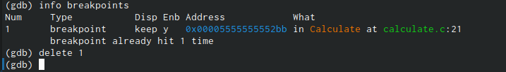{ #fig:022 width=70% }

Далее воспользовалась командами «splint calculate.c» и «splint main.c» (рис.23-24).C помощью утилиты splint выяснилось, что в файлах calculate.c и main.c присутствует функция чтения scanf, возвращающая целое число (тип int), но эти числа не используются и нигде не сохранятся. Утилита вывела предупреждение о том, что в файле calculate.c происходит сравнение вещественного числа с нулем. Также возвращаемые значения (тип double) в функциях pow, sqrt, sin, cos и tan записываются в переменную типа float, что свидетельствует о потери данных.

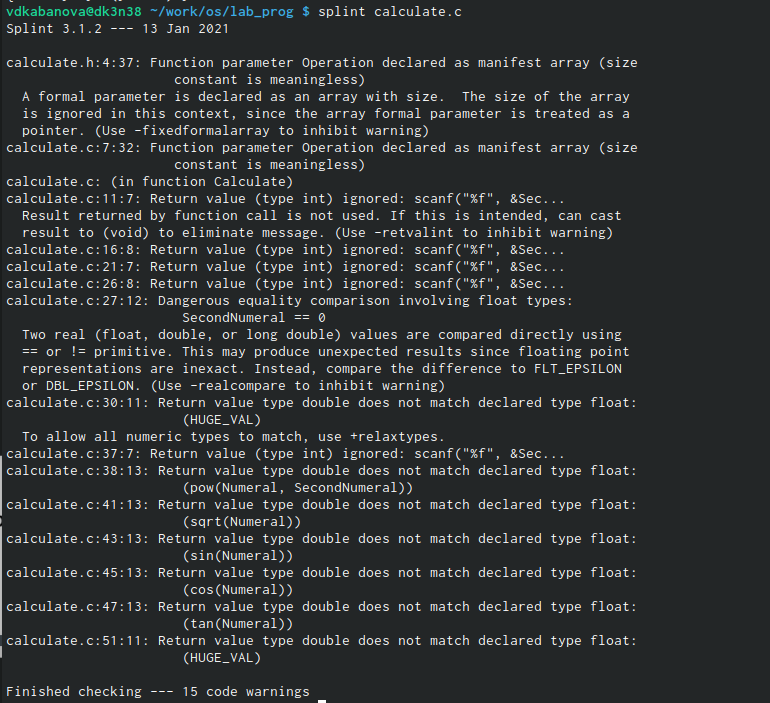{ #fig:023 width=70% }

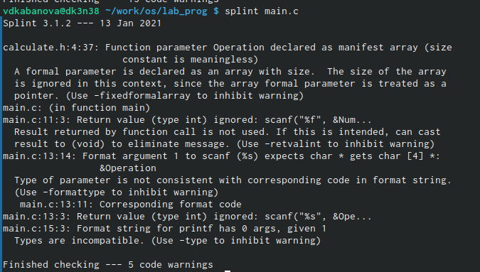{ #fig:024 width=70% }

Контрольные вопросы:

1. Чтобы получить информацию о возможностях программ gcc, make, gdbи др.нужно воспользоваться командой manили опцией -help(-h)для каждой команды.

2. Процесс разработки программного обеспечения обычно разделяется на следующие этапы: 

- планирование,  включающее  сбор  и  анализ  требований  к 
функционалу  и  другим  характеристикам  разрабатываемого приложения; 
- проектирование,  включающее  в  себя  разработку  базовых алгоритмов    и    спецификаций,    определение    языка программирования; 
- непосредственная разработка приложения: oкодирование −по  сути  создание  исходного  текста программы (возможно в нескольких вариантах); –анализ разработанного кода; oсборка, компиляция и разработка исполняемого модуля; oтестирование  и  отладка,  сохранение  произведённых изменений; 
- документирование. Для  создания  исходного  текста  программы  разработчик  может воспользоваться любым удобным для него редактором текста: vi, vim, mceditor, emacs, geanyи др. После  завершения  написания  исходного  кода  программы  (возможно состоящей из нескольких файлов), необходимо её скомпилировать и получить исполняемый модуль.

3. Для имени  входного  файла  суффикс  определяет  какая  компиляция требуется. Суффиксы указывают на тип объекта. Файлы с расширением (суффиксом) .cвоспринимаются gccкак программы на языке С, файлы с  расширением  .ccили  .C−как  файлы  на  языке C++,  а  файлы cрасширением .oсчитаются объектными.Например, в команде «gcc-cmain.c»:gccпо расширению (суффиксу) .cраспознает тип файла для компиляции и формирует объектный модуль −файл с расширением .o. Если требуется получить исполняемый файл с определённым именем (например, hello), то требуется воспользоваться опцией -oи в качестве параметра задать имя создаваемого файла: «gcc-ohellomaiВ  ходе  выполнения  данной  лабораторной  работы  я  приобрелапростейшие  навыки  разработки,  анализа,  тестирования  и  отладки приложений  в  ОС  типа UNIX/Linuxна  примере  создания  на  языке программирования С калькулятора с простейшими функциями.n.c».

4. Основное  назначение  компилятора языка  Си  в UNIX заключается в компиляции всей программы и получении исполняемого файла/модуля.

5. Для сборки разрабатываемого приложения и собственно компиляции полезно   воспользоваться   утилитой make.   Она   позволяет автоматизировать процесс преобразования файлов программы из одной формы в другую, отслеживает взаимосвязи между файлами.

6. Для работы с утилитой makeнеобходимо в корне рабочего каталога с Вашим проектом создать файл с названием makefileили Makefile, в котором  будут  описаны  правила  обработки  файлов  Вашего программного комплекса. В самом простом случае Makefile имеет следующий синтаксис: <цель_1> <цель_2> ... : <зависимость_1> <зависимость_2> ...<команда 1>...<команда n>Сначала задаётся список целей, разделённых пробелами, за которым идёт двоеточие и список зависимостей. Затем в следующих строках указываются  команды.  Строки  с  командами  обязательно  должны начинаться с табуляции. В качестве цели в Makefileможет выступать имя файла или название какого-то действия. Зависимость задаёт исходные параметры (условия) для  достижения  указанной  цели.  Зависимость  также  может  быть названием  какого-то  действия.  Команды  −  собственно  действия, которые необходимо выполнить для достижения цели.Общий синтаксис Makefileимеет вид: target1 [target2...]:[:] [dependment1...][(tab)commands] [#commentary][(tab)commands] [#commentary]. Здесь знак # определяет начало комментария (содержимое от знака # и до  конца  строки  не  будет  обрабатываться.  Одинарное  двоеточие указывает на то, что последовательность команд должна содержаться в 
одной строке. Для переноса можно в длинной строке команд можно использовать обратный слэш (\). Двойное двоеточие указывает на то, что  последовательность  команд  может  содержаться  в  нескольких последовательных строках.Пример более сложного синтаксиса Makefile:## Makefile for abcd.c#CC = gccCFLAGS =# Compile abcd.c normalyabcd: abcd.c$(CC) -o abcd $(CFLAGS) abcd.cclean:-rm abcd *.o *~# EndMakefileforabcd.c. В этом примере в начале файла заданы три переменные: CC и CFLAGS. Затем указаны цели, их зависимости и соответствующие команды. В командах  происходит  обращение  к  значениям  переменных.  Цель  с именем cleanпроизводит очистку каталога от файлов, полученных в результате  компиляции. Для  её  описания  использованы  регулярные выражения.

7. Во  время  работы  над  кодом  программы  программист  неизбежно сталкивается с появлением ошибок в ней. Использование отладчика для поиска и устранения ошибок в программе существенно облегчает жизнь программиста. В комплект программ GNUдля ОС типа UNIXвходит отладчик GDB(GNUDebugger). Для использования GDB необходимо скомпилировать анализируемый код  программы  таким  образом,  чтобы  отладочная  информация содержалась  в  результирующем  бинарном  файле.  Для  этого  следует воспользоваться опцией -gкомпилятора gcc: gcc-cfile.c-g. После этого для начала работы с gdbнеобходимо в командной строке ввести  одноимённую  команду,  указав  в  качестве  аргумента анализируемый бинарный файл: gdbfile.o

8. Основные команды отладчика gdb:
- backtrace − вывод на экран пути к текущей точке останова (по сутивывод − названий всех функций);
- break − установить точку останова (в качестве параметра можетбыть указан номер строки или название функции);
- clear − удалить все точки останова в функции;
- continue − продолжить выполнение программы;
- delete − удалить точку останова;
- display − добавить  выражение  в  список  выражений,  значения которых  отображаются  при  достижении  точки  останова программы;
- finish − выполнить программу до момента выхода из функции;
- info breakpoints −вывести на экран список используемых точек останова;
- info  watchpoints −вывести  на  экран  список  используемых контрольных выражений;
- list − вывести на экран исходный код (вВ  ходе  выполнения  данной  лабораторной  работы  я  приобрелапростейшие  навыки  разработки,  анализа,  тестирования  и  отладки приложений  в  ОС  типа UNIX/Linuxна  примере  создания  на  языке программирования С калькулятора с простейшими функциями. качестве параметра может быть указано название файла и через двоеточие номера начальнойи конечной строк);
- next − выполнить  программу  пошагово,  но  без  выполнения вызываемых в программе функций;
- print − вывести  значение  указываемого  в  качестве  параметра выражения;
- run − запуск программы на выполнение;
- set − установить новое значение переменной;
- step − пошаговое выполнение программы;
- watch − установить  контрольное  выражение,  при  изменении значения которого программа будет остановлена. Для выхода из gdbможно воспользоваться командой quit (или её сокращённым  вариантом q)  или  комбинацией  клавиш Ctrl-d. Более подробную информацию по работе с gdb можно получить с помощью команд gdb-hи mangdb.

9. Cхема отладки программы показана в 6 пункте лабораторной работы.

10. При первом запуске компилятор не выдал никаких ошибок, но в коде программы main.c допущена  ошибка,  которую  компилятор  мог пропустить (возможно, из-за версии 8.3.0-19): в строке  scanf(“%s”, &Operation); нужно убрать знак &, потому что имя массивасимволов уже является указателемна первый элементэтого массива.

11. Система  разработки приложений UNIX предоставляет  различные средства, повышающие понимание исходного кода. К ним относятся:cscope −исследование функций, содержащихся в программе,lint −критическая проверка программ, написанных на языке Си.

12. Утилита splint анализирует  программный  код,  проверяет корректность  задания  аргументов  использованных  в  программе функций   и   типов   возвращаемых   значений,   обнаруживает синтаксические и семантические ошибки. В отличие от компилятора Cанализатор splintгенерирует комментарии с описанием разбора кода программы и осуществляет общий контроль, обнаруживая такие ошибки, как одинаковые объекты, определённые в разных файлах, или объекты, чьи значения не используются в работt программы,  переменные  с  некорректно  заданными  значениямии типами и многое другое.

# Выводы

В ходе выполнения данной лабораторной работы  я  приобрелапростейшие навыки разработки, анализа, тестирования и отладки приложений  в  ОС  типа UNIX/Linuxна примере создания на языке программирования С калькулятора с простейшими функциями.

