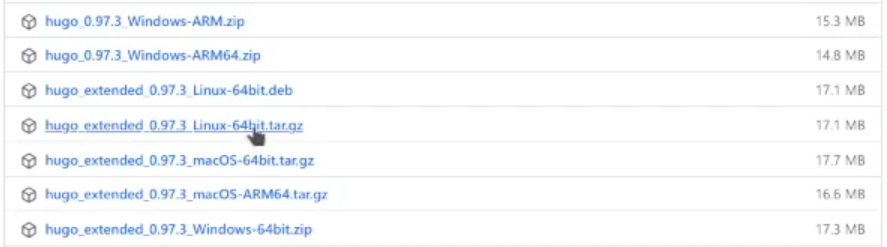
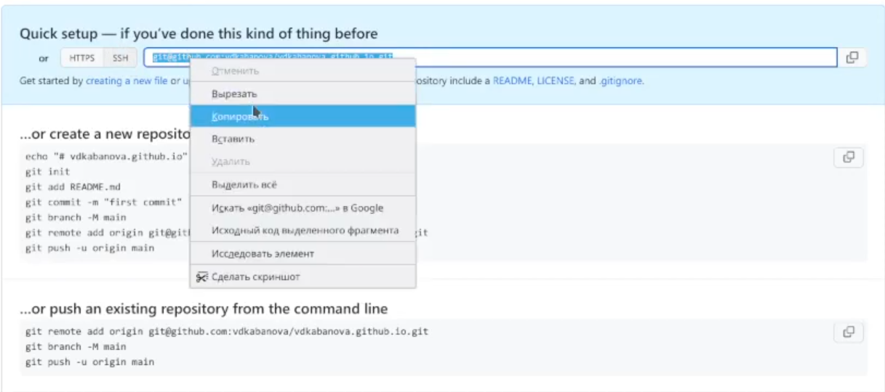
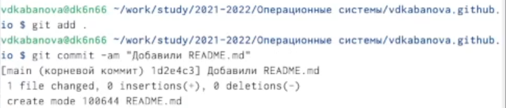

---
## Front matter
title: "Отчет по выполнению индивидульного проекта. 1 этап"
subtitle: "*Дисциплина: Операционные системы*"
author: "Кабанова Варвара Дмитриевна"

## Generic otions
lang: ru-RU
toc-title: "Содержание"

## Bibliography
bibliography: bib/cite.bib
csl: pandoc/csl/gost-r-7-0-5-2008-numeric.csl

## Pdf output format
toc: true # Table of contents
toc-depth: 2
lof: true # List of figures
lot: true # List of tables
fontsize: 12pt
linestretch: 1.5
papersize: a4
documentclass: scrreprt
## I18n polyglossia
polyglossia-lang:
  name: russian
  options:
	- spelling=modern
	- babelshorthands=true
polyglossia-otherlangs:
  name: english
## I18n babel
babel-lang: russian
babel-otherlangs: english
## Fonts
mainfont: PT Serif
romanfont: PT Serif
sansfont: PT Sans
monofont: PT Mono
mainfontoptions: Ligatures=TeX
romanfontoptions: Ligatures=TeX
sansfontoptions: Ligatures=TeX,Scale=MatchLowercase
monofontoptions: Scale=MatchLowercase,Scale=0.9
## Biblatex
biblatex: true
biblio-style: "gost-numeric"
biblatexoptions:
  - parentracker=true
  - backend=biber
  - hyperref=auto
  - language=auto
  - autolang=other*
  - citestyle=gost-numeric
## Pandoc-crossref LaTeX customization
figureTitle: "Рис."
tableTitle: "Таблица"
listingTitle: "Листинг"
lofTitle: "Список иллюстраций"
lotTitle: "Список таблиц"
lolTitle: "Листинги"
## Misc options
indent: true
header-includes:
  - \usepackage{indentfirst}
  - \usepackage{float} # keep figures where there are in the text
  - \floatplacement{figure}{H} # keep figures where there are in the text
---

# Цель работы

Научиться размещать на Github pages заготовки для персонального сайта.

# Выполнение лабораторной работы

На туис в курсе "Операционные системы" в разделе индивидуальный проект перехожу в Техническую реализацию проекта. Здесь нам представлены различные ссылки (рис. 1). Я выбираю ссылку на репозитоий с общими файлами тем. Создаю новый репозиторий на основе шаблона (рис. 2). Называю свой репозиторий следюущим образом: personal-project- (рис. 4)

{ #fig:001 width=70% }

{ #fig:002 width=70% }

{ #fig:004 width=70% }

Копирую ссылку на полученный репозиторий (рис. 3). Открываю терминал. Произвожу клонирвание с помощью команды git clone --recursive (рис. 5)

{ #fig:003 width=70% }

{ #fig:005 width=70% }

На туис в курсе "Операционные системы" в разделе индивидуальный проект перехожу в Инструкции. Перехожу по ссылке. Опускаюсь вниз страницы. Перехожу по ссылке в пункте 4.2 (Создание сайта на Hugo). Далее в пункте 1.2.3 (Ручная установка) перехожу по ссылке на архив с репозиториями (рис.6). Выбираю нужную версию (подчеркнута чертой) (рис.7). Произвожу установку. 

{ #fig:006 width=70% }

{ #fig:007 width=70% }

Архив сохраняется в загрузки. Извлекаю архив в текущую папку (рис. 8)

{ #fig:008 width=70% }

Далее в домашней папке создаю пустую папку bin (рис.9), куда перемещаю файл hugo из нашего архива (рис.10).

{ #fig:009 width=70% }

{ #fig:010 width=70% }

Вызываю файл hugo через его адрес (рис.11-12)

{ #fig:011 width=70% }

{ #fig:012 width=70% }

Перехожу по полученной ссылке (рис. 13). 

{ #fig:013 width=70% }

У нас открывается сайт, где на первой странице имеется зеленое поле с основной информацией о теме Academic (рис.14). 

{ #fig:014 width=70% }

Это поле для ознакомления, нам оно не нужно, поэтому удаляю его. Посмотрим, в каком из файлов в репозитории, хранится текст, задающий эту страницу. 

{ #fig:015 width=70% }

{ #fig:016 width=70% }

Файл demo.md по адресу ~/work/study/2021-2022/Операционные системы/personal-project-/
content/home как раз является таковым, так как никакой иной информации он не содержит, мы можем его удалить (рис.17-19).

{ #fig:017 width=70% }

{ #fig:018 width=70% }

{ #fig:019 width=70% }

Видим, как обновился сайт. Зеленое поле исчезло, остались нужные поля, первое из которых- биография (рис.20).

{ #fig:020 width=70% }

Создаю новый репозиторий на github (рис. 21).

{ #fig:021 width=70% }

Называю его особенным образом: vdkabanova.github.io (рис. 22)

{ #fig:022 width=70% } 

Копирую ссылку на полученный репозиторий (рис. 23). Открываю терминал. Произвожу клонирвание с помощью команды git clone --recursive (рис. 24). Уведомление указывает нам, что репозиторий пустой. 

{ #fig:023 width=70% }

{ #fig:024 width=70% }

Перехожу в каталог нового путого репозитория. Переключаюсь на новую ветку main (рис. 25)

{ #fig:025 width=70% }

Создаю пустой файл README.md (рис.26). 

{ #fig:026 width=70% }

Выгружаю все на github (рис.27-29)

{ #fig:027 width=70% }

{ #fig:028 width=70% }

{ #fig:029 width=70% }

Возвращаемся в каталог personal-progect- (рис. 30-31)

{ #fig:030 width=70% }

{ #fig:031 width=70% }

Связываем два репозитория с помощью команды git submodule add -b main. Добавляем подмодуль "public" (рис.32)

{ #fig:032 width=70% }

Уведомление указывает нам на сбой в добавлении, с помощью команд ls, cat выясняем, где содержится другой каталог public (рис.33-34). 

{ #fig:033 width=70% }

{ #fig:034 width=70% }

Переходим в gitignore. Клмментируем с помощью # public. Сохраняем изменения (рис.35-37).
 
{ #fig:035 width=70% }

{ #fig:036 width=70% }

{ #fig:037 width=70% }

Пробуем еще раз связать два репозитория с помощью команды git submodule add -b main. Добавление подмодуля "public" прошло успешно (рис.38-39)

{ #fig:038 width=70% }

{ #fig:039 width=70% }

Вызываю файл hugo через его адрес (рис.40). Видим, что каталог pubic заполнился файлами (рис. 41)

{ #fig:040 width=70% }

{ #fig:041 width=70% }

Перехожу в каталог public, проверяю, внешний вид ссылки (рис. 42) 

{ #fig:042 width=70% }

В файле config.yaml по адресу ~/work/study/2021-2022/Операционные системы/personal-project-/config/_default изменяю ссылку (рис.43-44)

{ #fig:043 width=70% }

{ #fig:044 width=70% }

Вызываю файл hugo через его адрес (рис.45).

{ #fig:045 width=70% }

 Отправляю все на github (рис. 46-48)

{ #fig:046 width=70% }

{ #fig:047 width=70% }

{ #fig:048 width=70% }

Открываю github, вижу, что во второй репозиторий были отправлены файлы из первого (рис. 49), копирую имя репозитория (рис.50). Вставляю в поисковую строку (рис.51). Видим, что по новой ссылке у нас открывается сайт (рис. 52)

{ #fig:049 width=70% }

{ #fig:050 width=70% }

{ #fig:051 width=70% }

{ #fig:052 width=70% }

# Выводы

В ходе выполнения данной лабораторной работы я научилась размещать на Github pages заготовки для персонального сайта. Я установила необходимое программное обеспечение, скачала шаблон темы сайта, разместила его на хостинге git, установила параметр для URLs сайта, а также разместила заготовку сайта на Github pages.

::: {#refs}
:::
