---
## Front matter
title: "Отчет по выполнению индивидульного проекта. 3 этап"
subtitle: "*Дисциплина: Операционные системы*"
author: "Кабанова Варвара Дмитриевна"

## Generic otions
lang: ru-RU
toc-title: "Содержание"

## Bibliography
bibliography: bib/cite.bib
csl: pandoc/csl/gost-r-7-0-5-2008-numeric.csl

## Pdf output format
toc: true # Table of contents
toc-depth: 2
lof: true # List of figures
lot: true # List of tables
fontsize: 12pt
linestretch: 1.5
papersize: a4
documentclass: scrreprt
## I18n polyglossia
polyglossia-lang:
  name: russian
  options:
	- spelling=modern
	- babelshorthands=true
polyglossia-otherlangs:
  name: english
## I18n babel
babel-lang: russian
babel-otherlangs: english
## Fonts
mainfont: PT Serif
romanfont: PT Serif
sansfont: PT Sans
monofont: PT Mono
mainfontoptions: Ligatures=TeX
romanfontoptions: Ligatures=TeX
sansfontoptions: Ligatures=TeX,Scale=MatchLowercase
monofontoptions: Scale=MatchLowercase,Scale=0.9
## Biblatex
biblatex: true
biblio-style: "gost-numeric"
biblatexoptions:
  - parentracker=true
  - backend=biber
  - hyperref=auto
  - language=auto
  - autolang=other*
  - citestyle=gost-numeric
## Pandoc-crossref LaTeX customization
figureTitle: "Рис."
tableTitle: "Таблица"
listingTitle: "Листинг"
lofTitle: "Список иллюстраций"
lotTitle: "Список таблиц"
lolTitle: "Листинги"
## Misc options
indent: true
header-includes:
  - \usepackage{indentfirst}
  - \usepackage{float} # keep figures where there are in the text
  - \floatplacement{figure}{H} # keep figures where there are in the text
---

# Цель работы

Научиться добавлять к сайту достижения

# Выполнение лабораторной работы

В папке ~/work/study/2021-2022/Операционные системы/personal-project-/
content/home вижу наличие 3 файлов: skills.md, experience.md, accomplishments.md. Поработаем со всеми (рис. 1)

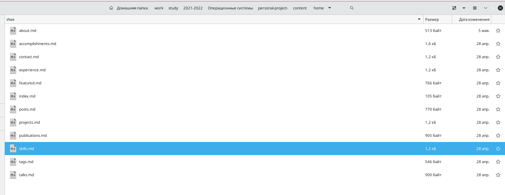{ #fig:001 width=70% }

В файле skills.md перехожу по ссылке, где нам предоставлена информация о всех наборах иконок, воспользуемся набором emoji (рис. 2-4)

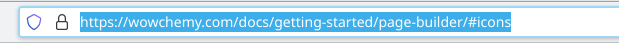{ #fig:002 width=70% }

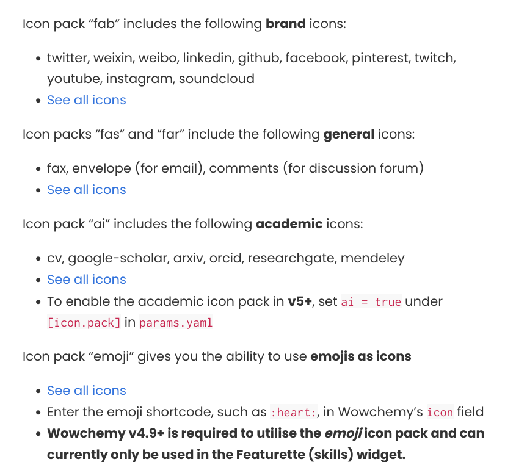{ #fig:003 width=70% }

{ #fig:004 width=70% }

Вносим изменения в наш файл, все поля заполняем по форме. которая представлена в комментариях (рис. 5)

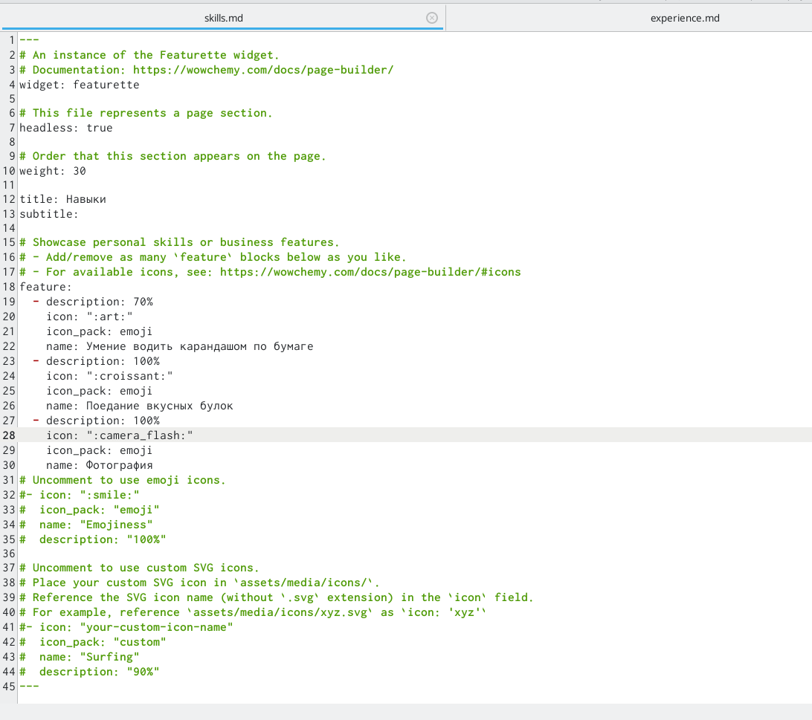{ #fig:005 width=70% }

Открываю терминал, с помощью команды ~/bin/hugo server проверяю исправность работы сервера и не допустила ли я ошибок. Вызываю ~/bin/hugo

Перехожу по ссылке, сгенерированной с помощью команды ~/bin/hugo server, здесь с нашим сайтом будут происходить все первоначальные изменения (после каждого вызова команды ~/bin/hugo server). Посмотрим, что изменилось (рис.6)

{ #fig:006 width=70% }

Вношу изменения в файл experience.md (рис.7)

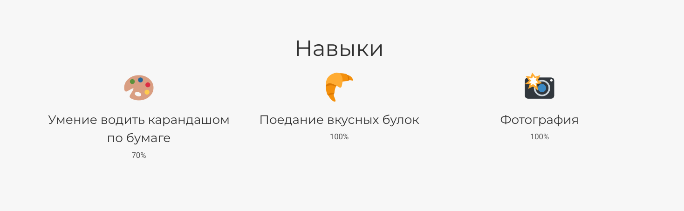{ #fig:007 width=70% }

Открываю терминал, с помощью команды ~/bin/hugo server проверяю исправность работы сервера и не допустила ли я ошибок. Вызываю ~/bin/hugo

Перехожу по ссылке, сгенерированной с помощью команды ~/bin/hugo server, здесь с нашим сайтом будут происходить все первоначальные изменения (после каждого вызова команды ~/bin/hugo server). Посмотрим, что изменилось (рис.8)

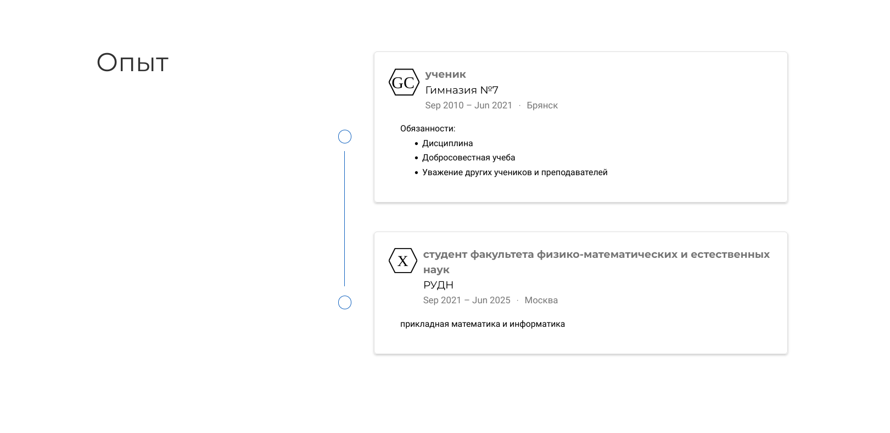{ #fig:008 width=70% }

Вношу изменения в файл accomplishments.md (рис. 9)

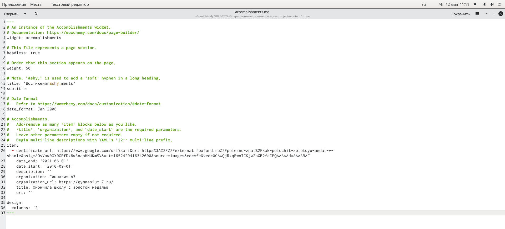{ #fig:009 width=70% }

Открываю терминал, с помощью команды ~/bin/hugo server проверяю исправность работы сервера и не допустила ли я ошибок. Вызываю ~/bin/hugo

Перехожу по ссылке, сгенерированной с помощью команды ~/bin/hugo server, здесь с нашим сайтом будут происходить все первоначальные изменения (после каждого вызова команды ~/bin/hugo server). Посмотрим, что изменилось (рис.10)

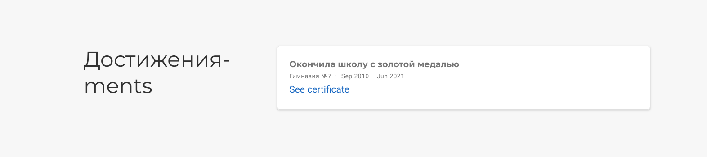{ #fig:010 width=70% }

В терминале с помощью команды hugo создаю новый текстовый документ post3.md в папке post (рис.11)

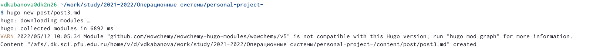{ #fig:011 width=70% }

Помещаю документ и картинку к нему в отдельную папку post3, переименовываю текстовый документ в index.md, а картинку в featured.jpg (рис.12)

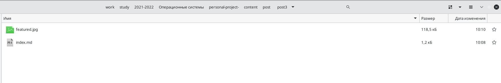{ #fig:012 width=70% }

Открываю файл и вношу изменения (рис. 13). 

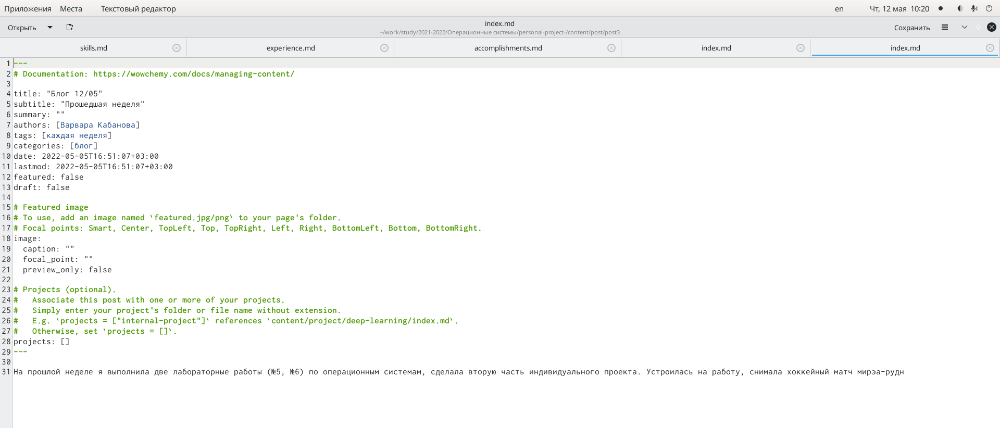{ #fig:013 width=70% }

В терминале с помощью команды hugo создаю новый текстовый документ post4.md в папке post (рис.14)

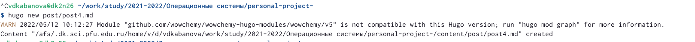{ #fig:014 width=70% }

Помещаю документ и картинку к нему в отдельную папку post4, переименовываю текстовый документ в index.md, а картинку в featured.jpg (рис.15)

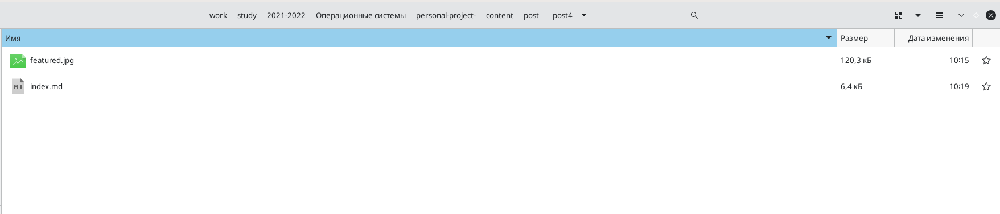{ #fig:015 width=70% }

Открываю файл и вношу изменения (рис. 16-17). 

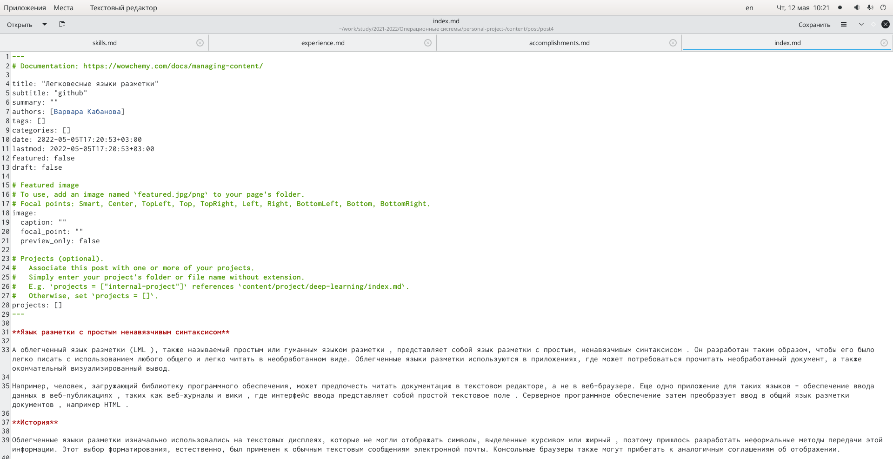{ #fig:016 width=70% }

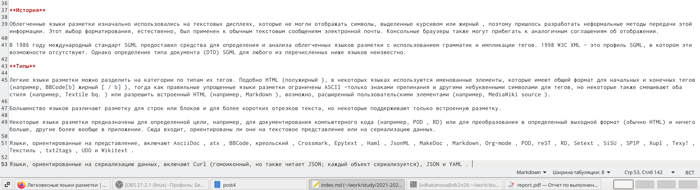{ #fig:017 width=70% }

Открываю терминал, с помощью команды ~/bin/hugo server проверяю исправность работы сервера и не допустила ли я ошибок. Вызываю ~/bin/hugo (рис.18)

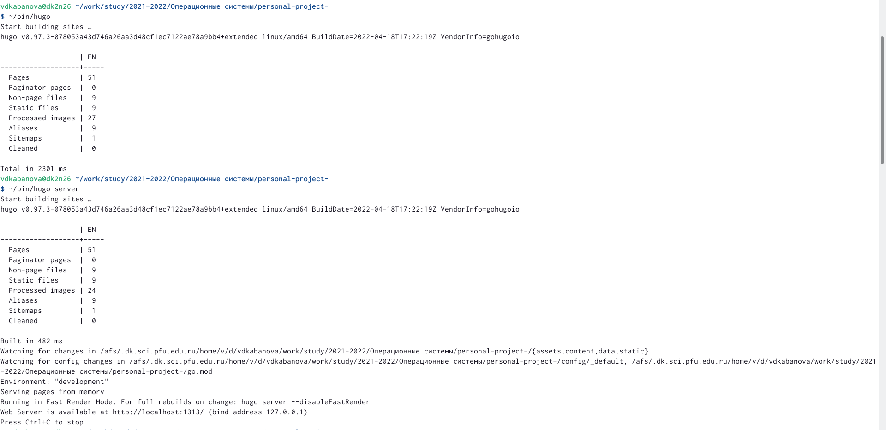{ #fig:018 width=70% }

Перехожу по ссылке, сгенерированной с помощью команды ~/bin/hugo server, здесь с нашим сайтом будут происходить все первоначальные изменения (после каждого вызова команды ~/bin/hugo server). Посмотрим, что изменилось (рис.19-25)

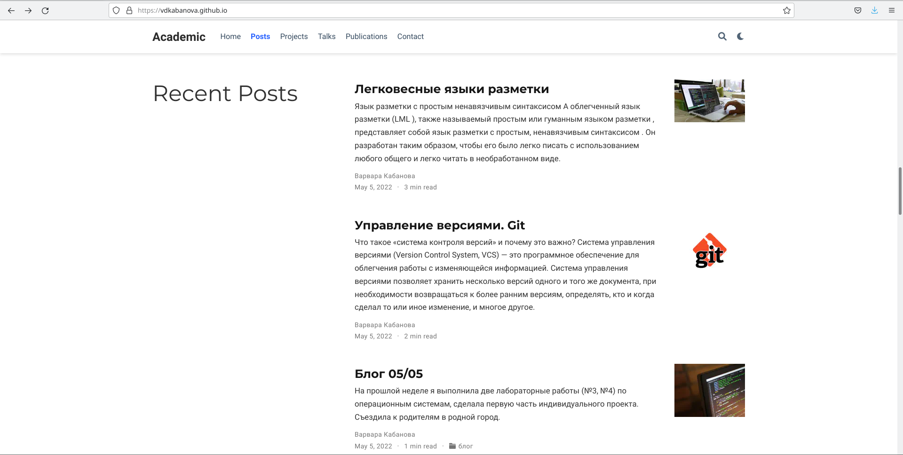{ #fig:019 width=70% }

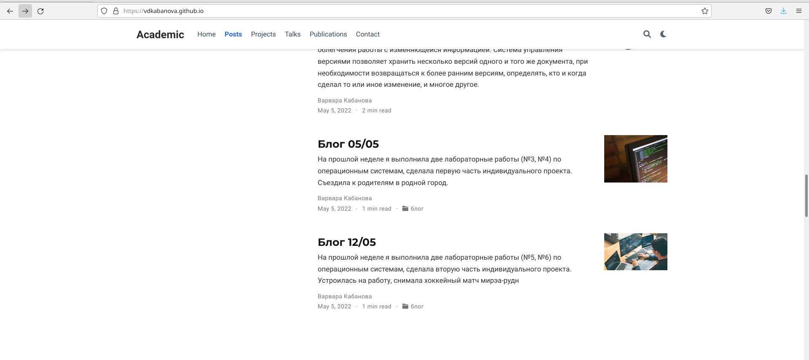{ #fig:020 width=70% }

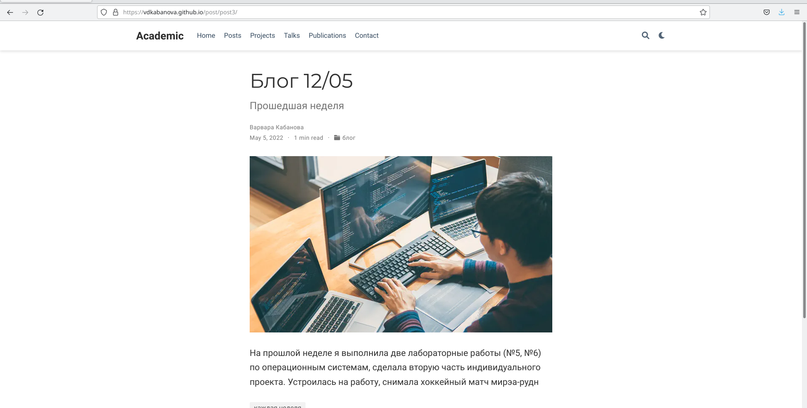{ #fig:021 width=70% }

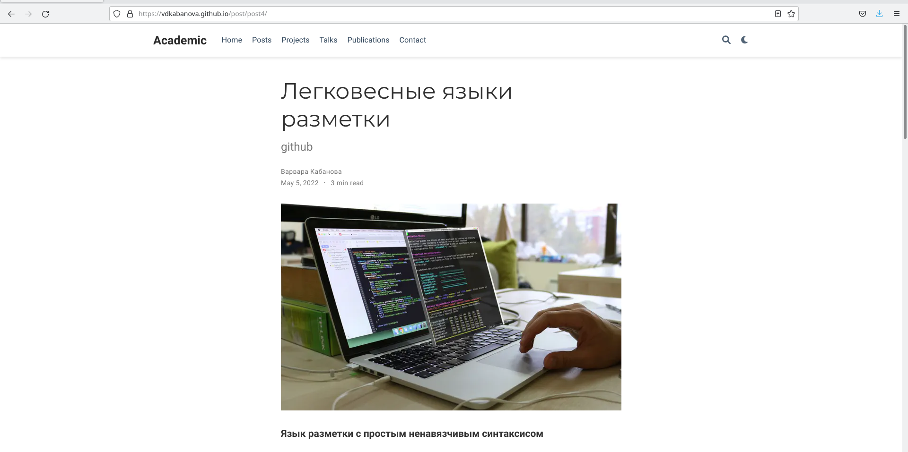{ #fig:022 width=70% } 

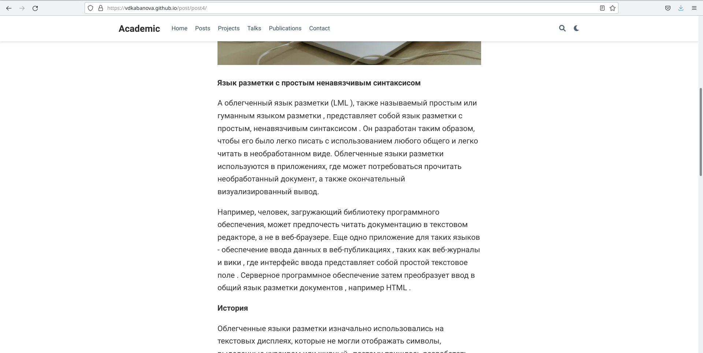{ #fig:023 width=70% }

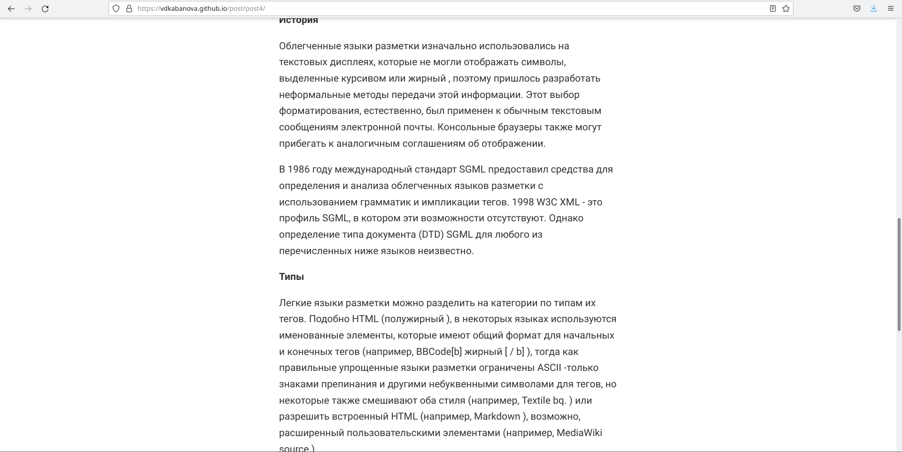{ #fig:024 width=70% }

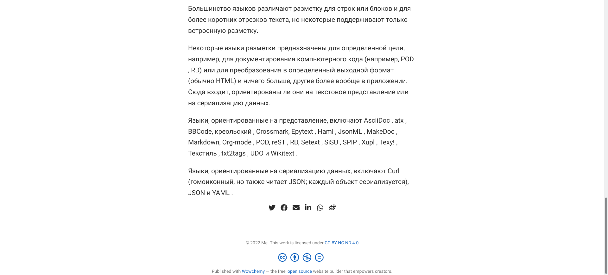{ #fig:025 width=70% }

# Выводы

В ходе выполнения данной лабораторной работы я научилась добавлять к сайту достижения, поняла, как добавлять информацию о навыках, об опыте.  

::: {#refs}
:::
